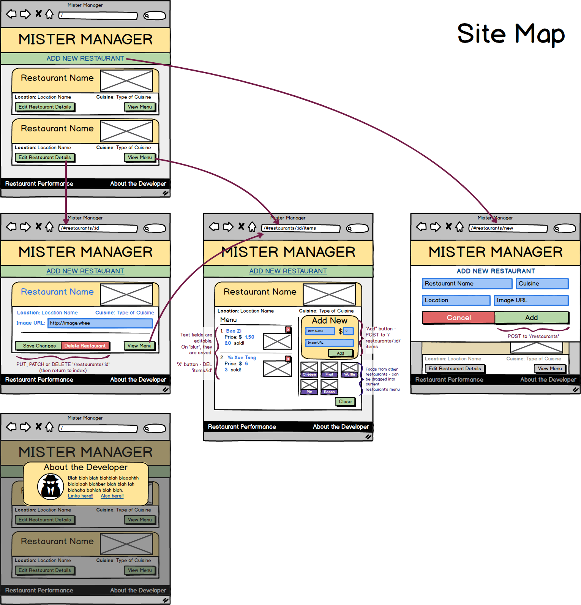

#Restaurant Manager

Restaurant Manager is a one-page web application that allows for the management of multiple restaurants' menus and menu items.

<!-- ###<a href='http://45.55.146.194:3000/'>Live Demo</a> -->
<!-- Note - currently down -->

##Features

1. User can create, read, update, and delete restaurants.
2. User can create, read, update, and delete items.
3. User can utilize every feature of the app without reloading the page.
4. User can view information about the developer.
5. User can view estimated caloric content of menu items.
6. User can view the profitability of each item, calculated in real time on each menu list item.
7. User can view a chart displaying the top ten most profitable items.
8. User can drag items from any other restaurant into the restaurant they're currently viewing.

##Scripts & External Stylesheets

###Scripts

#####jQuery
A library with the ability to "wrap" DOM elements in a special object that has many functions assigned to it. These functions expand on and create shortcuts for many vanilla JavaScript functions for interacting with the DOM. In this app, jQuery was mainly used to make accessing and manipulating DOM elements easier and faster.
#####Director.js
Director.js is a library that allows for the creation of a router. This router listens for changes to the 'location.href' property - particularly to the text after the '#' symbol - and executes a function based on the address. I feel Director could have been implemented to a larger extent in this application - I used a mix of event listeners and routes. I plan to make these more consistent.
#####Underscore.js
Javascript library that contains a lot of "shortcuts" for iterative functions. This library was used to simplify the modification of data within objects and arrays, to extract data from objects and for more advanced sorting functions.
#####Mustache
A templating library. This library was used to render data into HTML templates that are then displayed on the webpage.
#####Draggabilly
A fairly lightweight library that allows items to be dragged around the page by the user. Used to allow menu items to be dragged into a restaurant's menu.
#####Droppabilly
Droppabilly expands on the function of Draggabilly by allowing for the creation of "droppable" objects. These objects can accept and react to draggable objects that are dragged over or dropped on them.
#####Chart.js
This library generates responsive, aesthetically pleasing charts and graphs from JSON datasets. Used to visually represent data about the top ten most profitable items in the user's database.

###Stylesheets

#####Normalize.css
Used to standardize the default way CSS is rendered across different browsers.
#####Skeleton.css
Provides a simple, bare-bones grid and more attractive basic styling for standard HTML elements (lists, headers, tables, forms, etc.)
#####Animate.css
Provides simple, easy-to-apply animations for almost any element on the webpage. Used mostly to animate entrances.

##Construction

###Data Structure (ERD)

###Wireframe

###Routes

| Method  | Route  | Action |
| ------------- | --------------- | ----- |
| GET | '/' OR '/index.html' | Loads index.html |
| GET | '/restaurants' | sends all restaurant data objects back in an array |
| POST | '/restaurants' | adds a new restaurant object to the database, sends back the new data object that's been created |
| GET | '/restaurants/:id' | sends one restaurant data object back that matches ':id' |
| PUT | '/restaurants/:id' | updates every property of the existing data object that matches ':id' |
| PATCH | '/restaurants/:id' | updates a single property of the existing data object that matches ':id' |
| DELETE | '/restaurants/:id' | deletes an existing data object in the database that matches ':id' |
| GET | '/restaurants/:id/items' | returns an array of items where the 'postId' property matches the restaurant's 'id' property. |
| PUT | '/restaurants/1/items' | adds an item to the specified restaurant (note - check if this auto-generates a 'postId' field) |
| DELETE | '/items/:itemId' | deletes an item of a particular id. |
